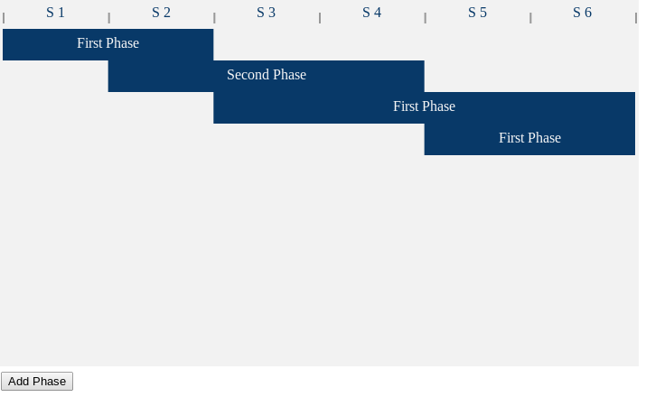

gant-planning
=============

D3js based planning editor

# [Demo Page](http://javascript-ninja.fr/planning/)




### HTML:

	<svg id="demo"></svg>

### JS:
```
var planning=gantplanning
	.createPlanning()
	.fill([
		{"description":"First Phase","start":0,"end":2},
		{"description":"Second Phase","start":3,"end":6}
	])
	.attachTo(document.getElementById('demo'))
	.draw();
```
